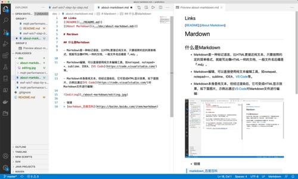

## Links
[[README](../README.md)]
[[About Markdown](<../doc/about-markdown.md>)]

# Mardown

## 什么是Markdown

- Markdown是一种标记语言，比HTML更接近纯文本，只要按照约定的简单格式，就能写出像HTML一样的文档，一般文件名后缀是『.md』。

- Markdown编辑，可以直接使用纯文本编辑工具，如notepad、notepad++、sublime、IDEA、[VS Code](https://code.visualstudio.com/)等。

- Markdown本身是纯文本，但经过渲染后，它可变成HTML显示效果，如下面图片，示例出通过[VS Code](https://code.visualstudio.com/)对Markdown文件进行编辑：



- 链接
> [markdown_百度百科](https://baike.baidu.com/item/markdown)

## Markdown渲染工具

### linux/osx

```bash
alias madness='docker run --rm -it -v $PWD:/docs -p 3333:3000 dannyben/madness'
madness server
```

### windows
```shell
vim C:\Windows\madness.cmd
docker run --rm -it -v "%cd%:/docs" -p 3333:3000 dannyben/madness %1
madness server
```
