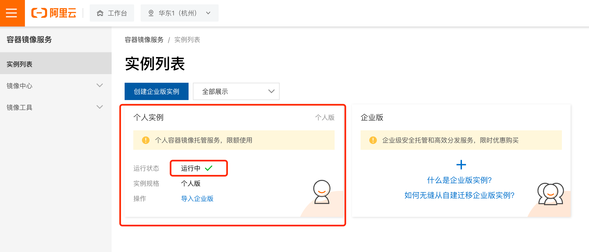
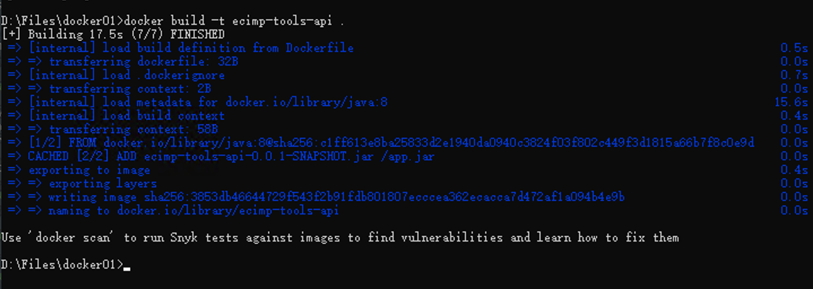
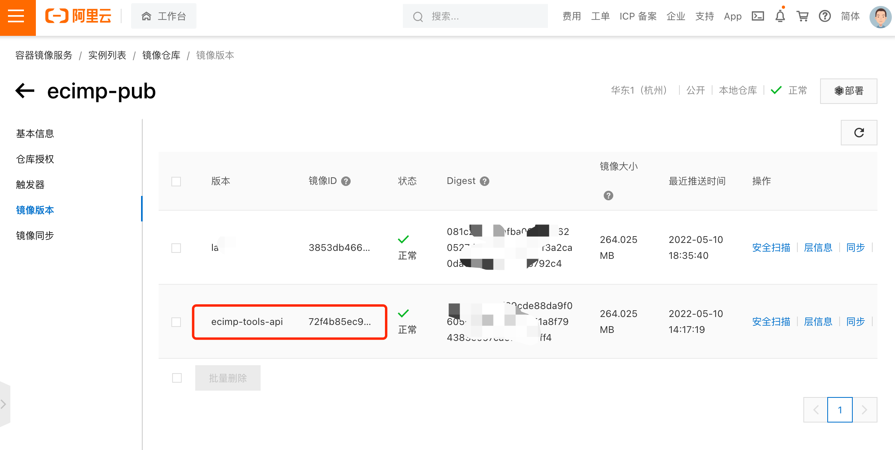
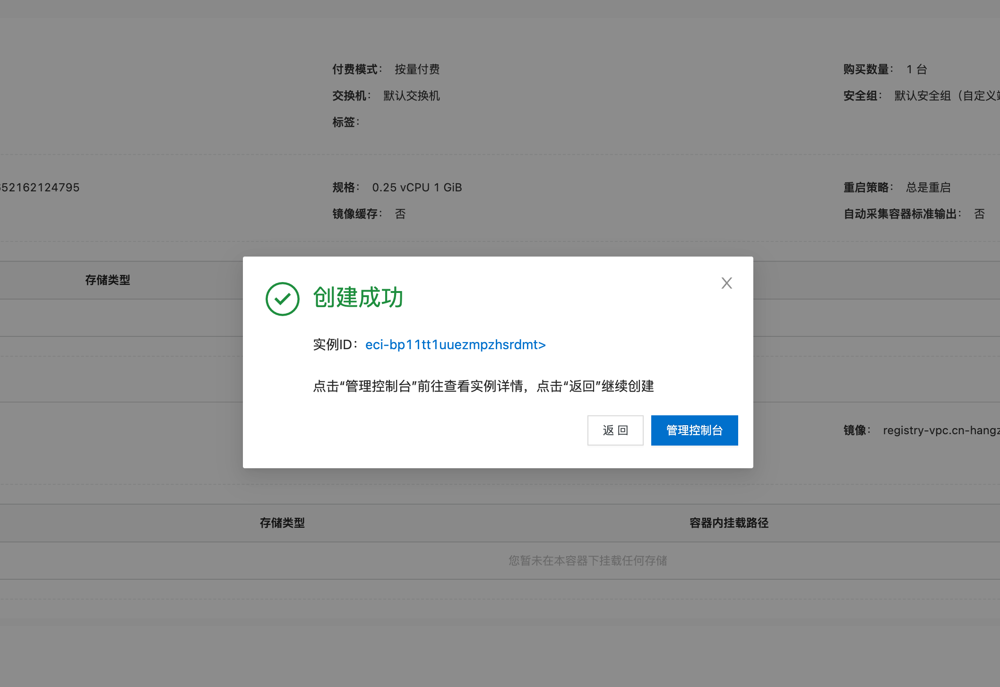
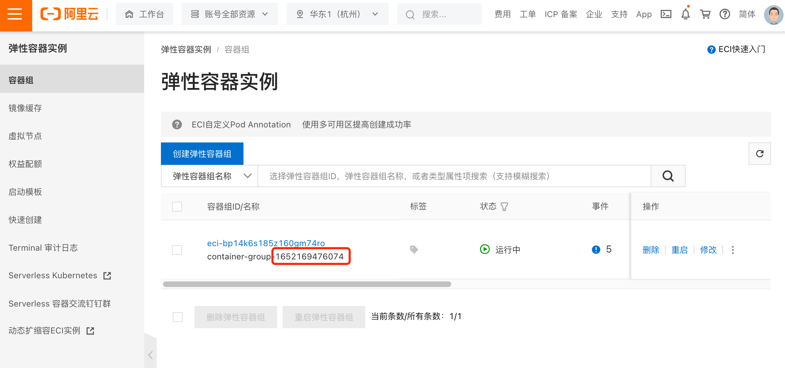
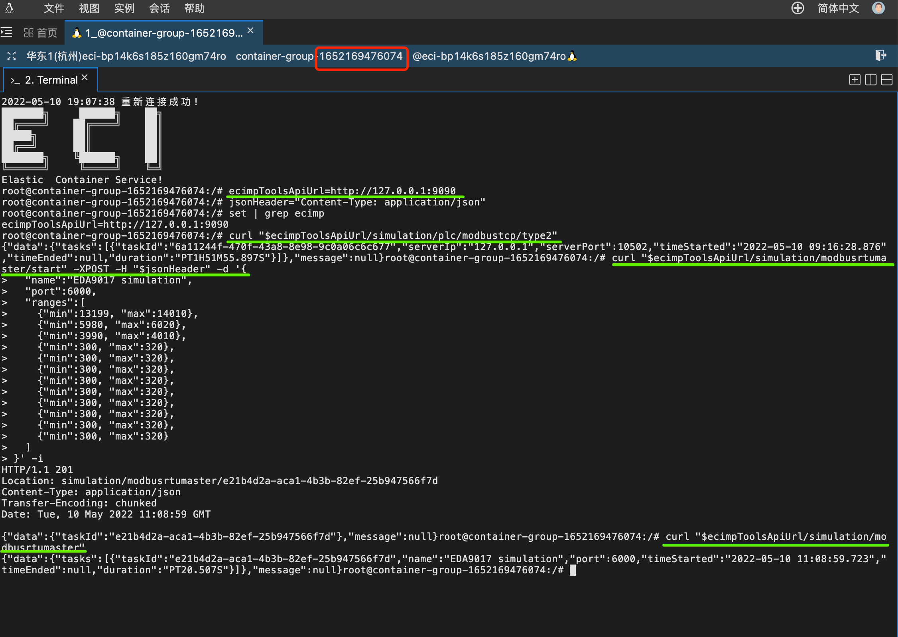

## Links
[[README](../README.md)]
[[java to aliyun-docker](<../doc/java-to-aliyun-docker.md>)]

# java to aliyun docker

## 1. 下载安装Docker Desktop

下载

> [Docker Desktop](https://www.docker.com/products/docker-desktop/)

安装之后，系统就支持Docker的各种命令和功能，参考：

> [docker (base command)](https://docs.docker.com/engine/reference/commandline/docker/)

## 2. aliyun - 容器镜像服务

### 2.1. 容器镜像服务

需要创建一个『容器镜像服务』实例，用于存放我们自定义的镜像，容器创建时需要用到该镜像。

- 镜像（[image](https://docs.docker.com/get-started/overview/#:~:text=of%20those%20objects.-,Images,-An%20image%20is)）：理解为一个运行环境模板
  - 镜像一般是定义在一个文本文件里（文件名通常固定为Dockerfile）的一些定义指令
  - 用 [Docker Desktop](<#1-下载安装Docker-Desktop>) 的『docker build』命令，对Dockerfile编译成实际的镜像
  - 通过 [Docker Desktop](<#1-下载安装Docker-Desktop>) 的『docker run』命令，就可以创建 **容器** 并运行
  - 可以通过『docker image push』命令，把镜像推到阿里云
  - Dockerfile定义的指令一般是如下（但不限于）：
    - 定义镜像是基于哪个操作系统，如ubuntu、centos等
    - 操作系统的运行环境设置
      - 环境变量设置
      - 目录定义
    - 要添加什么文件进去该操作系统
    - 要添加什么用户进去该操作系统
    - 暴露哪些端口
    - 启动时命令
    - 等等……

- 容器（[container](https://docs.docker.com/get-started/overview/#:~:text=other%20virtualization%20technologies.-,Containers,-A%20container%20is)）：理解为镜像的实例
  - 镜像是对运行环境的定义，实际运行的是以镜像为模板的一个或者多个容器
  - 如果把镜像推到阿里云上，那么就可以在阿里云上运行一个或者多个容器


### 2.2. 创建『容器镜像服务』的『个人实例』

创建的时候设置需要登录的密码，界面如下：



### 2.3 本地 Docker Desktop 登录到阿里云『容器镜像服务』

登录过程需要输入上一步所设置的密码。

```shell
docker login --username=you_username registry.cn-hangzhou.aliyuncs.com
```

## 3. build docker image

### 3.1. mvn package

```bash
mvn package -Dmaven.test.skip=true
```

### 3.2. make Dockerfile

make new file, filename=Dockerfile, without suffix

```bash
vi Dockerfile
```

content in the "Dockerfile" file as below

```dockerfile
FROM java:8
VOLUME /tmp
ADD ecimp-tools-api-0.0.1.jar /app.jar
ENTRYPOINT ["java", "-Djava.security.egd=file:/dev/./urandom", "-jar", "/app.jar"]
EXPOSE 8080
```

### 3.3 build Dockerfile

1. copy Dockerfile and ecimp-tools-api-0.0.1.jar to D:\Files\docker01

2. "docker build" command

```bash
docker build -t ecimp-tools-api
```



3. check whether the build success

```bash
D:\Files\docker01>docker images
REPOSITORY                                          TAG               IMAGE ID       CREATED           SIZE
ecimp-tools-api                                     latest            3853db466447   2 minutes ago     676MB

D:\Files\docker01>
```

4. push image to aliyun (IMAGE ID=3853db466447)

```bash
D:\Files\docker01>docker tag 3853db466447 registry.cn-hangzhou.aliyuncs.com/ecimp/ecimp-pub

D:\Files\docker01>docker images
REPOSITORY                                          TAG               IMAGE ID       CREATED           SIZE
ecimp-tools-api                                     latest            3853db466447   2 minutes ago     676MB
registry.cn-hangzhou.aliyuncs.com/ecimp/ecimp-pub   latest            3853db466447   2 minutes ago     676MB

D:\Files\docker01>docker image push registry.cn-hangzhou.aliyuncs.com/ecimp/ecimp-pub
Using default tag: latest
The push refers to repository [registry.cn-hangzhou.aliyuncs.com/ecimp/ecimp-pub]
4e47e687a952: Layer already exists
35c20f26d188: Layer already exists
c3fe59dd9556: Layer already exists
6ed1a81ba5b6: Layer already exists
a3483ce177ce: Layer already exists
ce6c8756685b: Layer already exists
30339f20ced0: Layer already exists
0eb22bfb707d: Layer already exists
a2ae92ffcd29: Layer already exists
latest: digest: sha256:081c2a51bcafba090b49620527d62409839536f3a2ca0da67a8c4960c53792c4 size: 2212

D:\Files\docker01>
```

5. login to aliyun console, check whether the image pushed



## 4. aliyun - 弹性容器实例ECI

### 4.1. new ECI instance

login to aliyun console and create ECI. select the docker image which pushed by previous steps.




### 4.2. check whether your api is running



### 4.3. enter bash console inside the container

点击『容器组ID/名称』的链接 -> 『Workbench远程连接』。

进入容器内部的bash命令行时，可以通过curl命令，检验ecimp-tools-api是否工作。


